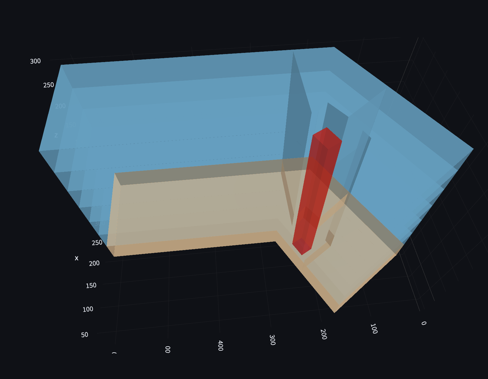
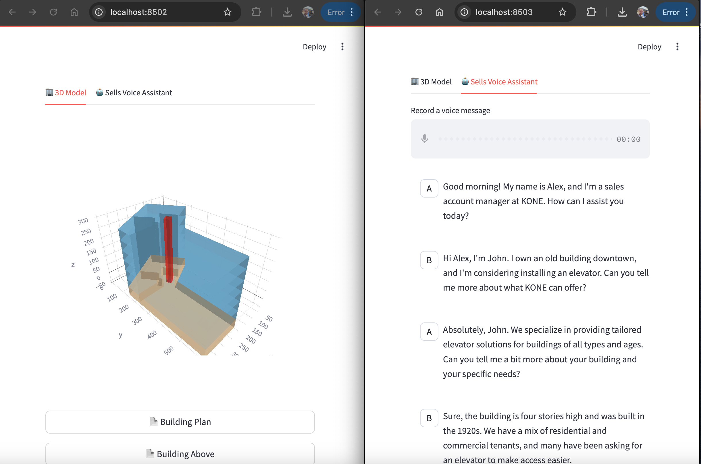
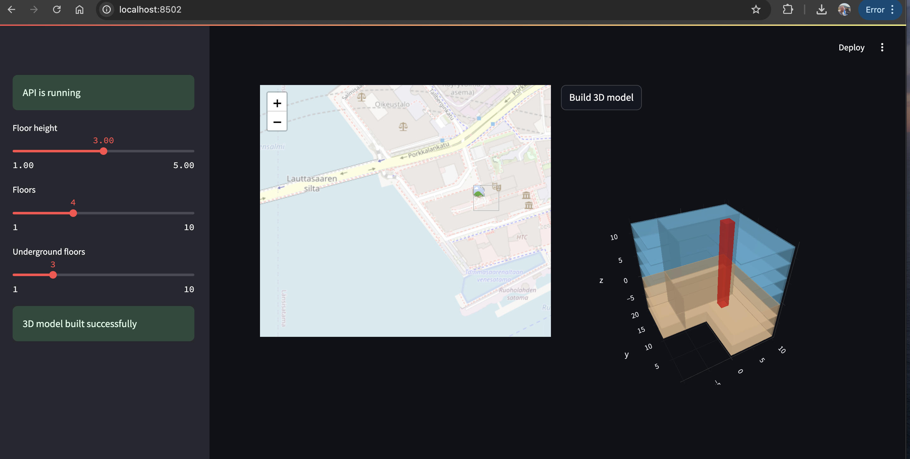

# Junction Hackathon 2024 - KONE's Challenge

# Backend Python 3D Model and Sells Conversation AI Assistant

Main Technologies:
- Python
- FastAPI
- Streamlit


## Serve the FastAPI API:



```bash
cd api
uvicorn app:app --reload
```

## Serve the Streamlit UI (developed to be embedded in the main Frontend app as an iframe):



```bash
cd streamlit_ui
streamlit run viz3d_server.py
```

## Serve the Dev Streamlit UI:



```bash
cd streamlit_ui
streamlit run viz3d_client.py
```
